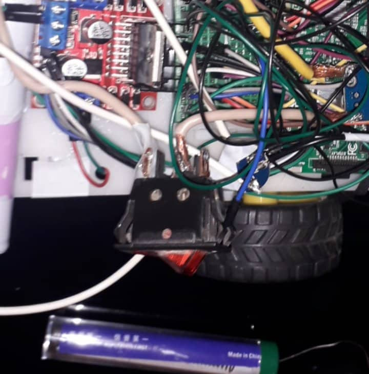

# freeuni-car
This project, also known as "Freecar", was initially developed as a Sophomore Project at Free University of Tbilisi. 
The aim was to create a remote controlled toy car using a Raspberry Pi, 
which could be controlled via a web interface and would have various fun features.
It was a complex project where we all learned much about engineering. 
Currently, this repository is archived and the hardware of the car itself is disassembled, only the early prototype videos and pictures are displayed here.

<figure>
  
  <figcaption>Picture: Early prototype showcase of the project</figcaption>
</figure>

## Features
- The car hosted a web server and allowed users to connect to it through Campus Wi-Fi. The web interface displayed a live stream from the car's camera and provided WASD controls for movement. 
- Using the SHIFT key increased the engine power to 100%. 
- The project also utilized OpenCV library for environment analysis, including brightness detection and automatic activation of LED headlights in low-light conditions.
- As a safety mechanism, an ultrasonic sensor was attached to the bottom of the car, preventing it from being pushed off high obstacles 
such as tables and stairs.
- The car had the ability to display its current location across the University Campus, based on the strength of Wi-Fi signals.
  This was possible thanks to [FIND Framework](https://github.com/schollz/find).
- Remaining capacity of rechargable Li-ion batteries was displayed on the screen.
- Many other misc features were available, such as taking a screenshot, showing a black and white image, etc.
- An unfinished feature was auto-navigation and finding a charging station when the battery was low.

## File Descriptions
### Python Files
- **freecar.py** - This file sets up a socket communication for the toy car and establishes a connection with a client. It imports necessary modules and classes from other files like `engine`, `find`, `tracking`, `headlights`, `charging`, and `battery_life`.
- **engine.py** - Responsible for controlling the motors of the car using RPi.GPIO library.
- **battery_life.py** - Responsible for monitoring the battery life and sending battery percentage updates through a connection.
- **charging.py** - This file is supposed to move the car towards the charging station when the battery drains. However, this file worked for a very intricate setup which cannot easily be replicated.
- **find.py** - Responsible for updating and sending the location of the car through a connection.
- **headlights.py** - Responsible for updating the status of the headlights based on the received data.
- **tracking.py** - This file is responsible for updating the safety status and checking for potential danger in the forward direction using an ultrasonic sensor.

<figure>

<figcaption>Picture: Freecar in the dark with headlights on</figcaption>
</figure>

### Web Files
- **index.html** - Main web page for controlling the Freecar. It includes buttons for starting and stopping video streaming, toggling effects, and capturing images. It handles key events and data channels for exchanging information with the Raspberry Pi on the car.
- **main.js** - Logic for starting and stopping video streaming, capturing images, toggling effects such as location display, headlights, safety features and lines (for debugging auto-charging feature). It also handles WebSocket communication and updates the canvas.
- **singalling.js** - Sets up a signaling object for establishing a WebRTC connection with a car.

## Hardware Parts
Unfortunately, we don't have the exact list for the hardware parts used. All the retrieved images and videos are from the early prototype stage. However, we compiled a possibly incomplete list of used hardware parts:
- 2WD Robot Car Chassis
- Raspberry Pi 3
- 2.0MP Camera module compatible with Raspberry Pi
- Dual H-Bridge Motor Driver
- ADS1115 16-Bit Analog-to-Digital Converter
- 4x 10A 3500mAh Li-ion Batteries
- Protection Board for Li-ion Batteries
- LM2596 DC-DC 1.25V-35V Step Down Converter
- HC-SR04 Ultrasonic Distance Sensor
- Breadboard for on-car circuits
- White LEDs for headlights
- Switch for manual control of battery
- Button for hard reset

<figure>
  
  <figcaption>Picture: Early close up picture of the car</figcaption>
</figure>

## Future Development
Unfortunately, Freecar was disassembled a couple of months after finishing the Sophomore Project. We could not find videos that could showcase the finished version of this car. No future development of this project is planned, and repository is archived. Feel free to explore this repository, fork it if you want, or use parts of the code.

<figure>
  
  <figcaption>Picture: Video captured when Freecar was still attached to the DC source</figcaption>
</figure>
